# flintd

[](https://github.com/harshkedia177/flintd/actions/workflows/gate.yml)
[](https://www.npmjs.com/package/@flintd/sdk)
[](https://www.npmjs.com/package/flintd)
[](https://pypi.org/project/flintd/)
[](LICENSE)

**A library of tools your agent writes for itself, tested before anything can call them.**

An agent works out how to do a fiddly job, gets it right, and then the session ends. Next week it writes the same
code from scratch and gets it wrong again. Nothing it learned survives. The usual answer is to stop and hand-write
an MCP server, and then you maintain tools instead of doing the work.

flintd lets the agent keep what it figured out. The agent writes the tool and flintd decides whether the tool is any
good. Its own examples run before anything is saved. Examples its author never sees decide whether search returns
it. Real use decides whether it joins the default tool list.



## Which one do I need?

- **You are writing your own agent loop.** Install [`@flintd/sdk`](#build-it-into-your-own-loop). No daemon, no
  port, no token. flintd runs in your process.
- **You use Claude Code, Codex, OpenCode, Hermes, OpenClaw or pi.** Install
  [the daemon](#connect-your-coding-agent). Those are separate programs, so something has to hold the Library and
  answer them.

Both reach the same Library through the same interface. Start embedded and move to the daemon by changing one
argument.

## Build it into your own loop

```
npm i @flintd/sdk
```

```ts
import { createFlint, callFrom } from "@flintd/sdk"

const flint = createFlint({ dir: "./library" })
await flint.start()

// Hand these to your model. The model writes its own tools with them.
const tools = await flint.tools("openai")

// Hand back whatever tool-call block the model produced.
const result = await callFrom(flint, "openai", block)
```

`tools(format)` answers finished tool definitions and `callFrom` answers the result block that provider expects,
error slot included. The formats are `anthropic`, `openai`, `openai-chat`, `gemini`, `vercel` and `mcp`, so
switching provider changes one string.

**`dir` is embedded and `url` is remote, and the two answer the same interface, method for method.**

```ts
const flint = createFlint({ url: "http://127.0.0.1:3546", token })
```

A loop you develop in-process moves to the shared daemon by changing that one argument, and nothing downstream
knows the difference.

Four adapters skip the format step and hand a framework its own tool objects. Each takes the framework's factory as
an argument, so flintd imports no framework at runtime and type-checks against the version you installed.

| Framework | The call | What it answers |
| --- | --- | --- |
| Vercel AI SDK | `vercelTools(flint, {dynamicTool, jsonSchema})` | `{tools, prepareStep}` for `generateText`, refilled before every step |
| OpenAI Agents | `openaiAgentsTools(flint, tool)` | function tools, each with an `isEnabled` that asks the Library again once a turn |
| LangChain | `langchainModelCall(flint, tool)` | a `wrapModelCall` body that puts the Library into every model call |
| Google ADK | `googleAdkToolset(flint, {BaseToolset, FunctionTool, Type})` | one toolset whose `getTools` resolves per invocation |

[**The SDK quickstart**](docs/quickstarts/sdk.md) walks the whole path: embedded, remote, one adapter end to end,
and where the token comes from. Per provider: [Anthropic](docs/quickstarts/sdk-anthropic.md),
[OpenAI](docs/quickstarts/sdk-openai.md), [Gemini](docs/quickstarts/sdk-gemini.md),
[Vercel AI SDK](docs/quickstarts/sdk-vercel.md), [Python](docs/quickstarts/sdk-python.md).

## Connect your coding agent

One daemon on `127.0.0.1` serves one Library to everything on the machine, so a tool written inside Claude Code is
callable from Codex, from a hook, from the shell and from your own loop.

```
npm i -g flintd
flintd init --harness claude-code
```

`init` starts the daemon if nothing is listening, writes that harness's own MCP config and hook scripts where it
reads them, and prints the one environment variable you need to export. `--check` exits 1 when anything is missing,
and `flintd stop` ends the daemon.

| Harness | `--harness` | What `init` wires up |
| --- | --- | --- |
| [Claude Code](docs/quickstarts/claude-code.md) | `claude-code` | MCP over HTTP, three hooks, a skills directory |
| [Codex](docs/quickstarts/codex.md) | `codex` | MCP over HTTP, the same three hooks, a skills directory |
| [OpenCode](docs/quickstarts/opencode.md) | `opencode` | MCP over HTTP, a plugin, a skills directory |
| [Hermes](docs/quickstarts/hermes.md) | `hermes` | MCP over HTTP, a hook plugin, a skills directory |
| [OpenClaw](docs/quickstarts/openclaw.md) | `openclaw` | MCP over HTTP, a hook, a skills directory |
| [pi](docs/quickstarts/pi.md) | `pi` | an extension with its own MCP client, and no token to export |

[**The daemon quickstart**](docs/quickstarts/daemon.md) is the ten-minute version: start it, connect a harness,
write a tool, watch it reach Verified, call it.

## What the gate actually checks



A save runs every example first. One failure saves nothing and names what differed. A near-identical Verified or
Active tool refuses the save and names that tool.

Held-out examples are written afterwards by flintd's own model, never by the author, which is what makes passing
them evidence rather than a restatement. They need a model configured; without one a tool stays a Draft and every
other part of flintd still works, retrieval included.

Active is earned on five clean calls plus evidence that more than one turn used it: two sessions, two calendar days
or two harness names. Any one of the three is enough, so a burst inside one day from one harness does not count.
At most 50 tools are Active per tenant and the default tool list holds 30, best Contribution first. Nothing is
retired to make room; a person decides.

Every version is a git commit, so any version reads back and restores.

## Security

flintd runs code a model wrote, so the question is what stands between that code and your machine.

**A tool declares what it may reach, and the declaration is empty by default.** An empty declaration has no I/O
surface at all: the tool runs in QuickJS compiled to WebAssembly, with no `fetch`, no socket, no file and no
process. A directory, a hostname, a credential or a command waits for one human approval of that exact declaration.
Change the body and the approval no longer applies, because it is keyed to the body's digest.

**The declaration picks the runtime.** A tool runs at the strictest tier that satisfies what it asked for: QuickJS,
a Node child process under Node's permission model, or a container.

**One network path.** `ctx.fetch` is the only way out in every tier. It matches hostnames exactly, allows no
wildcard, and re-checks every redirect hop. A stored credential is attached there, so the body receives an id and
never a value. No worker environment carries a credential in any tier.

**The daemon binds `127.0.0.1` and nothing else.** Every route needs a bearer token compared in constant time, and
a request carrying a foreign `Origin` is refused before the token is checked.

[docs/security.md](docs/security.md) is the full account, including the three tiers and an explicit list of what
flintd does not promise. The Node tier is a seat belt rather than a sandbox, and the page says so plainly.

Found a hole? [SECURITY.md](SECURITY.md) has the private route.

## Documentation

Start at [**docs/**](docs/) for the full index.

| Page | What it holds |
| --- | --- |
| [Quickstarts](docs/quickstarts) | one page per harness, one per SDK and provider |
| [REST contract](docs/rest-contract.md) | the wire contract every client implements, and the source of truth for every claim here |
| [Security](docs/security.md) | the tiers, the declaration, the approval, the proxy, and the limits |
| [Configuration](docs/config.md) | every config key, its type, its default and the option it maps to |
| [Observer](docs/observer.md) | what it reads, what consent gates, and what it stores |
| [Evals](docs/evals.md) | the two test lanes, what the paid lane costs, and the thresholds |
| [Glossary](CONTEXT.md) | this project uses these words and no synonyms |

## Install

You install one of these. Which one depends on [which flintd you need](#which-one-do-i-need).

| Package | Install | For |
| --- | --- | --- |
| [`@flintd/sdk`](https://www.npmjs.com/package/@flintd/sdk) | `npm i @flintd/sdk` | your own agent loop, embedded or remote |
| [`flintd`](https://www.npmjs.com/package/flintd) | `npm i -g flintd` | the daemon and the CLI, for a coding agent |
| [`flintd`](https://pypi.org/project/flintd/) | `pip install flintd` | a Python loop, remote only |

Two more are published and nobody installs them on purpose:
[`@flintd/core`](https://www.npmjs.com/package/@flintd/core) is the engine both clients pull in, and
[`@flintd/pi`](https://www.npmjs.com/package/@flintd/pi) is fetched by pi's own extension loader.

Node 22.18 or newer. The container tier needs an engine that answers the `docker` command line.

## Contributing

[CONTRIBUTING.md](CONTRIBUTING.md) covers the gate and what a reviewer looks for.
[CODE_OF_CONDUCT.md](CODE_OF_CONDUCT.md) applies everywhere in the project.

## License

Apache-2.0. See [LICENSE](LICENSE).
